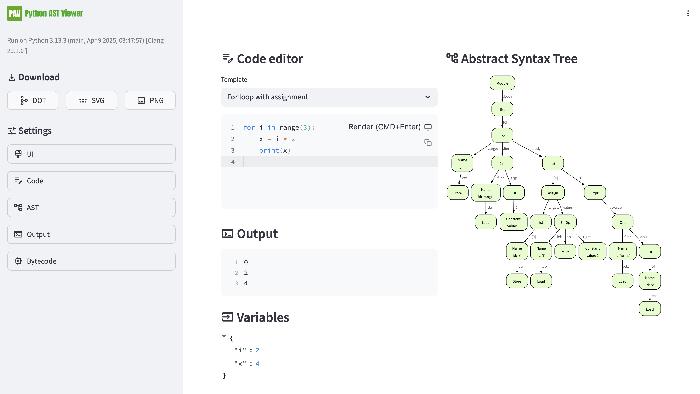

# Python AST Viewer

A powerful, interactive visualizer for Python Abstract Syntax Trees (AST) featuring code editing, bytecode viewing, and customizable UI.  
Inspired by [true-grue/astdot](https://github.com/true-grue/astdot) and a future Python self-study book by [grigoryvp](https://github.com/grigoryvp).



---

## 🚀 Quick Start

You can run the app locally using [uv](https://github.com/astral-sh/uv) for automatic environment management.

**Option 1: Direct command**
```sh
uv run streamlit run src/app.py
```

**Option 2: Makefile shortcut** (recommended, if you have make installed)

```sh
make runapp
```

## 🌐 Demo: GitHub Pages
A live, browser-based demo is available via GitHub Pages.

**Limitations**:

- Runs Python 3.11 directly in your browser using Pyodide.
- Everything is executed locally and anonymously—your code stays on your device.
- Due to browser and Pyodide constraints, some features may be limited (e.g., exporting SVG/PNG).
- For the best experience (performance and full feature set), it is recommended to run the app locally using uv and Streamlit.


## 🧪 Sandbox

Experiment with code and AST visualization in `sandbox.ipynb` (Jupyter).

These playground offer a safe place to explore the API, edit code blocks, and learn how the tool works step by step.


## ✨ Features

### Code Editor

- Syntax highlighting and editing with [streamlit-code-editor](https://github.com/bouzidanas/streamlit-code-editor)
- Quick switching between code samples

### Abstract Syntax Tree Visualization

- Parse and visualize any Python code (expressions, statements, whole scripts)
- Optimized and raw AST views
- Interactive display powered by Graphviz

### Bytecode & Output Viewer

- Disassemble and inspect bytecode with Python's `dis` module 
- View standard output, errors, and function results

### Flexible UI Settings

Tune every part of your experience:

- UI themes
- Code settings: choose editor features
- AST controls: optimization, parse modes
- Output and Bytecode: select view modes


## 🧑‍💻 Inspiration

Built on ideas and code from [true-grue/astdot](https://github.com/true-grue/astdot) (simple Python AST visualizer)
and a Future Python self-study book by [grigoryvp](https://github.com/grigoryvp).

## 🤝 Contributing

Feel free to open issues or submit PRs.


## 📖 License

MIT License.

See [LICENSE](LICENSE) for details.
